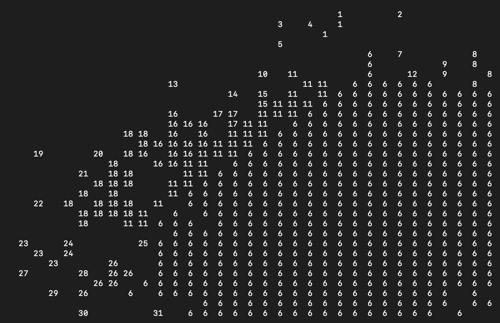
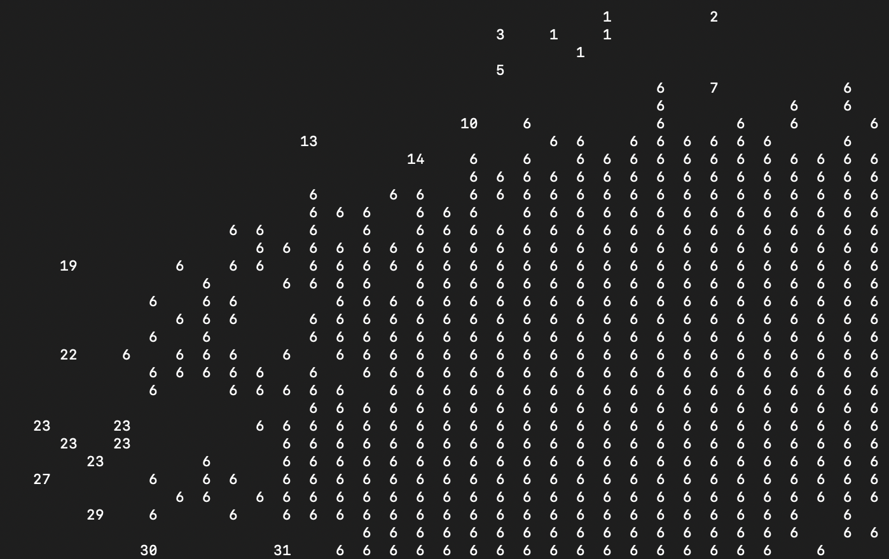

# Connected Component Labeling using Two-Pass Algorithm

This project contains the implementation of Connected Component Labeling using the Two-Pass Algorithm in both C and MIPS Assembly. The algorithm is used to label different connected components in binary images, where each pixel is represented by hex values stored in .txt files.

## Overview

In the C implementation, the labels are represented as integers, and the goal is to group connected pixels into the same label. In the MIPS Assembly implementation, a picture will be shown with different colors representing different components.

## Algorithm: Two Pass Algorithm

The Two-Pass Algorithm for Connected Component Labeling involves two main passes over the binary image. The algorithm proceeds as follows:

1. First Pass:
   - Traverse through the binary image, pixel by pixel, from the top-left corner to the bottom-right corner.
   - If the current pixel is part of a connected component (i.e., has a value of 1), assign a unique label to it. The label represents the connected component to which the pixel belongs.
   - Update the label equivalences to keep track of connected components that share the same label.

2. Second Pass:
   - Traverse through the binary image again, pixel by pixel.
   - For each labeled pixel (value > 0), update its label based on the label equivalences determined in the first pass. This step ensures that all connected pixels in the same component have the same label.

The result of the algorithm is a labeled image, where each connected component is assigned a unique label.

## Example Difference Map

Here is an example of what the generated output will look like:

  <h3>In C</h3>
  
  

  <h3>In MIPS Assembly</h3>
  

In the following examples, the picture at the top left represents the result from the first pass of the algorithm, while the picture on the right displays the outcome after the second pass. In the MIPS Assembly implementation, the image is colorized directly within the assembly code after the completion of the two-pass algorithm. The MIPS Assembly implementation is not merely colorizing the output generated by the C implementation; instead, it independently executes the entire Connected Component Labeling process, including the two-pass algorithm and the subsequent colorization of the connected components. 

## Images Used in the Comparison

For the purpose of this project, we have selected one astronomical images taken from the Hubble Telescope and the James Webb Telescope. The images are provided in the "TestFiles" folder inside C part:

- `Tile116-16-1-537.txt`

## Additional Notes

- This is one of the homework I did for GT ECE 2035. 

For any inquiries or feedback related to this project, please contact me.

---
Please note that the images used in this example are for illustration purposes only and do not represent actual data from the Hubble Telescope or the James Webb Telescope. I hold no rights to these images.
